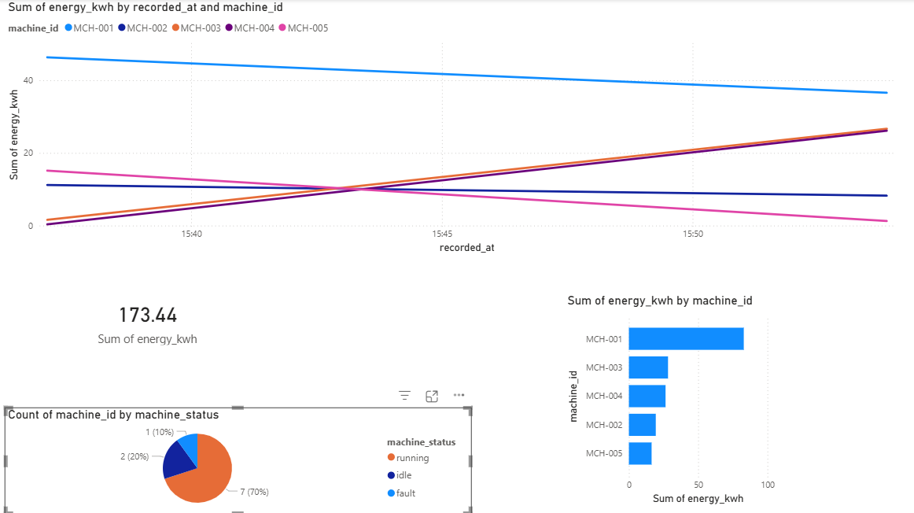

\# ⚡ Factory Energy Pipeline


An end-to-end data engineering pipeline that ingests factory sensor and weather data, transforms it into an analytics-ready data warehouse, detects anomalies using machine learning, and visualises insights on a live dashboard.


Built to demonstrate senior-level data engineering skills targeting industrial AI roles (Siemens, ABB, Honeywell).


\---


\## 🔴 Live Dashboard


👉 \[factory-energy-pipeline-satvik.streamlit.app](https://factory-energy-pipeline-satvik.streamlit.app)


\---


\## 🏗️ Architecture


┌─────────────────────────────────────────────────────────────┐

│                      DATA SOURCES                           │

│  \[Factory Sensor Generator]    \[Open-Meteo Weather API]     │

└──────────────┬──────────────────────────┬───────────────────┘

│                          │

▼                          ▼

┌─────────────────────────────────────────────────────────────┐

│                   PREFECT PIPELINE                          │

│  Task 1: Ingest → Task 2: Transform → Task 3: Detect       │

│           (Orchestrated with retries and logging)           │

└──────────────────────────────┬──────────────────────────────┘

│

▼

┌─────────────────────────────────────────────────────────────┐

│              SUPABASE PostgreSQL (Cloud)                    │

│  raw\_sensor\_data | raw\_weather\_data | fact\_energy\_hourly   │

└──────────────────────────────┬──────────────────────────────┘

│

▼

┌─────────────────────────────────────────────────────────────┐

│           STREAMLIT DASHBOARD (Streamlit Cloud)             │

│  Live charts | Anomaly alerts | KPIs | Weather overlay     │

└─────────────────────────────────────────────────────────────┘


\---


\## 🧱 Tech Stack


| Layer | Technology |

|---|---|

| Language | Python 3.11 |

| Pipeline Orchestration | Prefect 3.x |

| Data Manipulation | pandas |

| Database | PostgreSQL (Supabase cloud) |

| ORM / DB Driver | SQLAlchemy + psycopg2 |

| Weather API | Open-Meteo (free, no key required) |

| Anomaly Detection | scikit-learn Isolation Forest |

| Dashboard | Streamlit + Plotly |

| Deployment | Streamlit Cloud |

| Version Control | GitHub |


\---


\## 📊 Data Warehouse Schema


\### Raw Layer (never modified after ingestion)

\- `raw\_sensor\_data` — machine energy, temperature, production units, status

\- `raw\_weather\_data` — ambient temperature and humidity from Open-Meteo


\### Dimension Table

\- `dim\_machines` — machine reference data (name, type, zone, rated capacity)


\### Fact Table (analytics-ready)

\- `fact\_energy\_hourly` — cleaned, joined, feature-engineered data with anomaly flags


\---


\## 🤖 ML: Anomaly Detection


Uses \*\*Isolation Forest\*\* (scikit-learn) — an unsupervised algorithm that isolates anomalous readings based on how quickly they can be separated from normal data in a random decision tree forest.


Features used: `energy\_kwh`, `temperature\_c`, `rolling\_24h\_avg\_kwh`, `efficiency\_ratio`


Contamination rate: 5% (matches injected anomaly rate in sensor generator)


\---


\## 📁 Project Structure


├── pipeline/

│   ├── ingest\_sensors.py     # Simulates + stores factory sensor readings

│   ├── ingest\_weather.py     # Fetches + stores live weather from Open-Meteo

│   ├── transform.py          # Cleans, joins, engineers features

│   ├── detect\_anomalies.py   # Isolation Forest anomaly detection

│   └── flow.py               # Prefect flow orchestrating all tasks

│

├── dashboard/

│   └── app.py                # Streamlit dashboard

│

├── db/

│   └── schema.sql            # Table definitions

│

├── .env.example              # Environment variable template

├── requirements.txt          # Python dependencies

└── README.md


\---


\## 🚀 Running Locally


\### 1. Clone the repo

```bash

git clone https://github.com/SatvikSPandey/factory-energy-pipeline.git

cd factory-energy-pipeline

```


\### 2. Install dependencies

```bash

pip install -r requirements.txt

```


\### 3. Set up environment variables

```bash

cp .env.example .env

\# Edit .env and add your Supabase connection string

```


\### 4. Run the pipeline

```bash

python pipeline/flow.py

```


\### 5. Launch the dashboard

```bash

streamlit run dashboard/app.py

```


\---


\## 🔑 Environment Variables


| Variable | Description |

|---|---|

| `DATABASE\_URL` | Supabase PostgreSQL connection string (Session Pooler URI) |


\---

---

## 📊 Power BI Dashboard

A second dashboard was built in Power BI Desktop on top of the same Supabase PostgreSQL dataset, demonstrating BI reporting skills alongside the live Streamlit dashboard.



**Visuals included:**
- Energy consumption over time by machine (line chart)
- Total energy KPI card (173.44 kWh)
- Energy by machine (bar chart)
- Machine status distribution (pie chart — 70% running, 20% idle, 10% fault)

> Note: The Power BI report uses an imported dataset snapshot. The Streamlit dashboard connects directly to the live PostgreSQL database for real-time updates.


\## 👤 Author


\*\*Satvik Pandey\*\* — AI Engineer | Python Developer | LLM Systems  

\[GitHub](https://github.com/SatvikSPandey) | \[LinkedIn](https://www.linkedin.com/in/satvikpandey-433555365)

